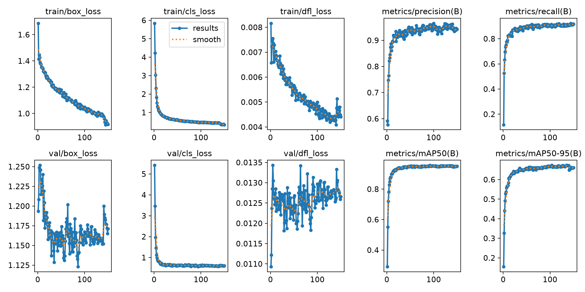

# RM 视觉培训作业成果 —— YOLO26n 单类目标检测

以 **YOLO26n** 为 baseline，在 RM 比赛图像上训练机器人检测模型。本仓库用于复盘整个训练全周期：数据划分、baseline、调参、误差分析、未标注数据利用，以及过程中踩过的坑。

仓库地址：<https://github.com/tianminmax/RM-YOLO26-Training>

| 项目     | 内容                                                    |
| -------- | ------------------------------------------------------- |
| 任务     | 单类别（`robot`）目标检测                               |
| 数据     | 1511 张已标注（6855 框，平均 4.54 框/图）+ 302 张未标注 |
| 划分     | train 1057 / val 227 / test 227（按框数分层，seed=42）  |
| 模型     | YOLO26n，COCO 预训练迁移                                |
| 硬件     | RTX 5060 Laptop 8G · 32 线程 · 14 GiB 内存              |
| 最佳实验 | `imgsz=960`、150 epochs（`exp_imgsz960_v2`）            |

## 最终成绩（test split，227 张 / 1036 个实例，全程未参与调参）

| 指标      | baseline (640) | 960 中断版 | **960 v2（最终）** | 相对提升  |
| --------- | -------------- | ---------- | ------------------ | --------- |
| mAP50     | 0.9393         | 0.9433     | **0.9594**         | +2.1%     |
| mAP75     | 0.7714         | 0.7846     | **0.8202**         | **+6.3%** |
| mAP50-95  | 0.6340         | 0.6489     | **0.6684**         | +5.4%     |
| Precision | 0.9333         | 0.9261     | **0.9518**         | —         |
| Recall    | 0.8913         | 0.8951     | **0.9146**         | —         |

推理速度 3.2 ms/张（imgsz=960，RTX 5060 Laptop，FP16）。



## 目录结构

```
RM-YOLO26-Training/
├── README.md                     本文件：总览与快速复现
├── docs/
│   ├── 01-训练报告.md             作业正式报告（问题、心得、训练表格）
│   ├── 02-训练全流程.md           从环境到交付的完整流程与决策规则
│   ├── 03-常见问题与排错.md       真实踩坑记录 + 排查方法论
│   ├── 04-实验记录与结论.md       逐实验配置、曲线、结论与消融分析
│   └── 05-训练过程详细数据.md     逐轮明细（每 10 轮汇总）、开销统计、可复现性证据
├── code/
│   ├── prepare_data.py           分层划分数据 + 生成 data.yaml
│   ├── train.py                  训练脚本（含续训护栏）
│   ├── eval.py                   评估（mAP50 / mAP75 / mAP50-95，落盘 JSON + 总表）
│   ├── analyze_errors.py         逐张误差分析（漏检清单 + 红蓝对比图）
│   ├── autolabel.py              未标注数据预标注（伪标签）
│   └── merge_addon.py            构建「原数据 + 新数据」独立数据集
├── configs/
│   └── data.yaml                 数据集配置（路径需按本机修改）
├── results/
│   ├── summary.csv               所有实验在 test 集上的指标总表
│   ├── all_epochs.csv            三个实验 496 轮的逐轮训练数据合并表
│   ├── baseline_n_640/           每个实验：args、results.csv、曲线、混淆矩阵、预测对比
│   ├── exp_imgsz960/
│   ├── exp_imgsz960_v2/
│   ├── test_eval/                test 集评估的 metrics.json 与曲线
│   └── autolabel_stats.csv       302 张未标注数据的预标注统计（已合并为一份）
├── figures/                      报告引用的关键图（含预标注示例、零检出样本）
└── weights/
    └── best_yolo26n_imgsz960.pt  最终模型权重（5.2 MB）
```

## 快速复现

```bash
# 0. 环境：Python 3.11 + torch 2.7.1+cu128 + ultralytics 8.4.7（用作业提供的本地源码）
conda activate ai-env

# 1. 划分数据（按框数分层，seed=42）
python code/prepare_data.py

# 2. baseline：imgsz=640
python code/train.py --name baseline_n_640 --epochs 200 --imgsz 640 --batch 8 --workers 2 --device 0

# 3. 提高输入分辨率：imgsz=960（唯一变量）
python code/train.py --name exp_imgsz960_v2 --epochs 150 --imgsz 960 --batch 4 --workers 2 --device 0

# 4. test 集评估（imgsz 必须与训练一致）
python code/eval.py --weights runs/exp_imgsz960_v2/weights/best.pt --split test --imgsz 960 --batch 4

# 5. 误差分析
python code/analyze_errors.py --weights runs/exp_imgsz960_v2/weights/best.pt --split test --imgsz 960
```

推理：

```python
from ultralytics import YOLO
model = YOLO("weights/best_yolo26n_imgsz960.pt")
model.predict("your_image.jpg", imgsz=960, conf=0.25, iou=0.7)
```

## 五条关键结论

1. **迁移学习效果显著**：前 10 个 epoch mAP50 就从 0.086 升到 0.868，预训练特征几乎被直接复用。
2. **瓶颈在定位而非检测**：mAP50 已达 0.96，mAP50-95 只有 0.67。提高输入分辨率（640→960）使 mAP75 提升 6.3%，远大于 mAP50 的 2.1%。
3. **mAP75 是最敏感的指标**，比 mAP50 更能反映定位质量，建议作为小目标任务的调参依据。
4. **数据划分决定结论可信度**：分层划分后 val 与 test 的 mAP50-95 仅差 0.0045，说明没有场景偏置；test 集全程只用一次。
5. **未标注数据的最优用法是半监督**：预标注试跑显示模型与人工标注的框密度几乎一致（4.50 vs 4.54 框/图），可进入人工核对阶段。

## 踩过的坑（详见 ）

- 训练把整机拖死：`workers` 过大 + 无 swap → 查 syslog 定位为资源耗尽，加 swap、限线程解决
- 续训被静默改掉 `imgsz`：曲线断裂，加护栏拒绝执行
- 推理 OOM 而训练正常：训练用 AMP 半精度，推理默认 FP32
- 302 张未标注数据不能当负样本用：会教模型"这里不要框"

## 说明

- 数据集与原始标注**未包含**在本仓库中，仅保留配置与统计。
- 所有指标均由 `code/` 中的脚本产出，可按上面的命令复现。
- 各实验的原始训练曲线与混淆矩阵见 `results/`，报告正文见 `docs/01-训练报告.md`。
- **关于 `code/`**：这些脚本原本放在作业根目录下运行（与 `codebase/`、`datasets/`、`runs/` 同级），脚本内部用 `Path(__file__).parent` 定位根目录。若要真正复现，请把 `code/` 里的脚本拷回作业根目录，或用 `--data` / `--project` 显式指定路径。本仓库保留源码是为了让流程可追溯。
