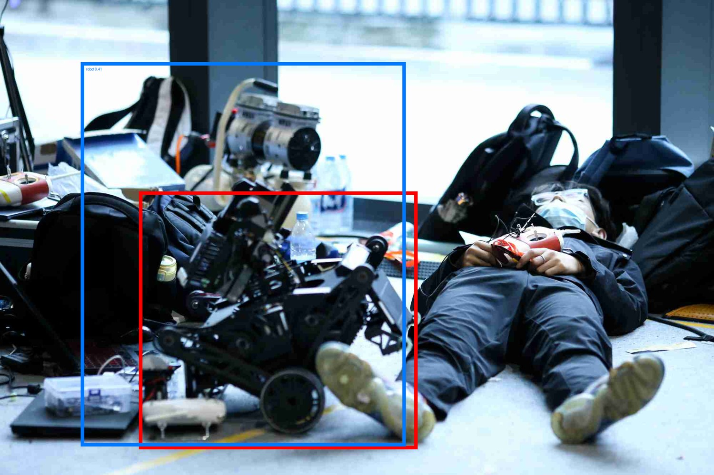
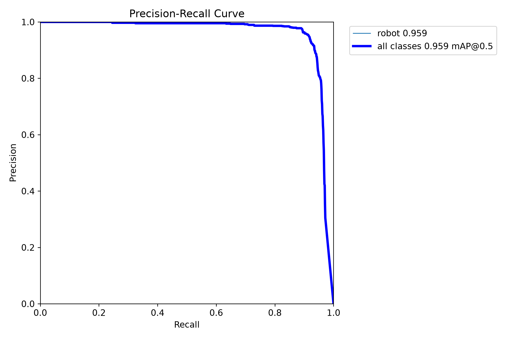
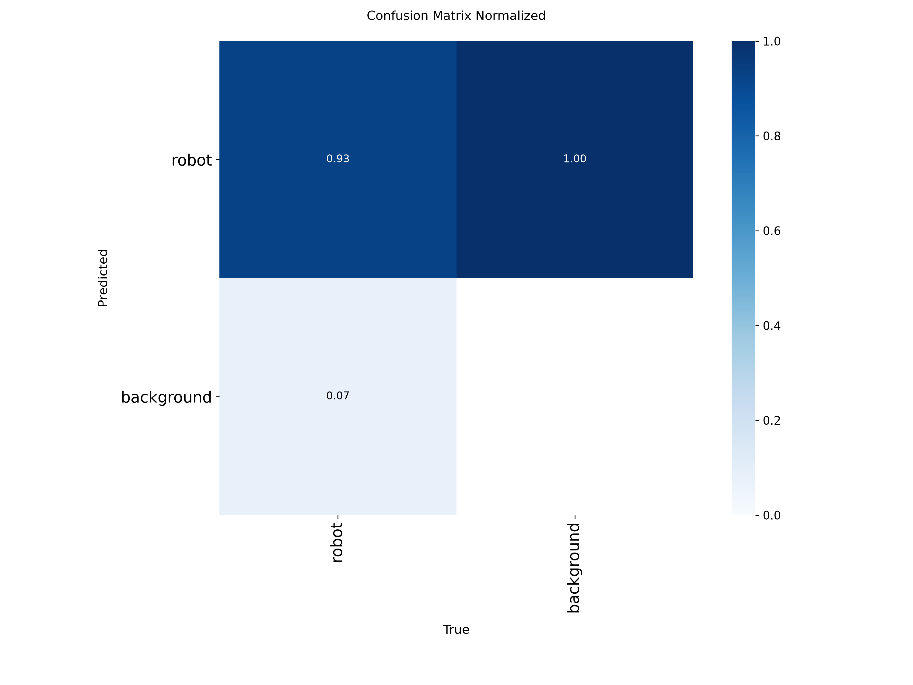
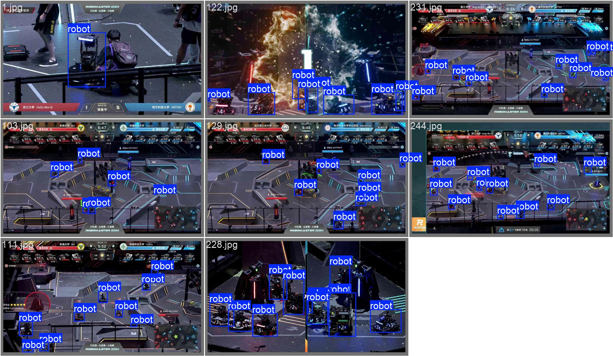

# RM 第四次培训作业 —— 基于 YOLO26n 的机器人目标检测

> 本文件是提交给培训方的正式报告。在本仓库中，报告引用的图表位于 `../figures/`，各实验的原始曲线与配置位于 `../results/`，最终权重为 `../weights/best_yolo26n_imgsz960.pt`；文中出现的 `runs/...` 路径指原始训练环境中的产物目录。

班级：自动化26**　　姓名：刘**

日期：2026-10-03

提交方式：压缩包（与邮件同名 `RM第四次培训-自动化2605-刘**.zip`），内含本文档 PDF 与权重文件 `刘**.pt`；邮件主题「RM第四次培训-自动化2605-刘\*\*」。

代码与实验记录：[github.com/tianminmax/RM-YOLO26-Training](https://github.com/tianminmax/RM-YOLO26-Training)（完整的训练全流程、逐轮训练数据、常见问题排查记录，以及全部实验的配置与曲线）

> 本文所有指标均来自训练与评估脚本的真实输出（`runs/*/results.csv`、`runs/summary.csv`），未做任何修改，可按附录 A 的命令完整复现。

---

## 目录

1. 任务理解与四要素
2. 训练原理理解（训练步骤 / 损失函数 / 无监督与半监督的区别）
3. 数据与划分
4. baseline 配置与训练过程
5. 遇到的问题、报错与解决
6. 调参记录与结果分析（训练表格 / test 集评估 / 误差分析）
7. 心得与下一步改进
   附录 A 可复现命令　|　附录 B 关键图片　|　附录 C 提交物清单

---

## 摘要

**任务**：以 YOLO26n 为 baseline，在 1511 张单类别标注数据上训练机器人检测模型，并提交训练表格与实验心得。

**最终模型**：`exp_imgsz960_v2`，输入尺寸 960。在全程未参与调参的 test split（227 张图、1036 个目标实例）上：

| 指标               | 结果                                          |
| ------------------ | --------------------------------------------- |
| mAP50              | **0.9594**                                    |
| mAP75              | **0.8202**                                    |
| mAP50-95           | **0.6684**                                    |
| Precision / Recall | 0.9518 / 0.9146                               |
| 推理速度           | 3.2 ms/张（imgsz=960，RTX 5060 Laptop，FP16） |

**主要结论**：

1. 提高输入分辨率是本次唯一带来实质提升的调参变量：640 → 960 使 mAP50 提升 2.1%、**mAP75 提升 6.3%**、mAP50-95 提升 5.4%。
2. 提升幅度随 IoU 阈值提高而放大，说明瓶颈是**定位精度**而非检测能力。
3. 训练过程中定位并解决了两类工程问题：资源耗尽导致的整机卡死、断点续训被静默覆盖输入尺寸，均已找到根因并加入防护。
4. 302 张未标注数据本次未并入训练，原因与可行方案见第 3 节与第 7 节。

---

## 1. 任务理解与四要素

| 四要素   | 本任务中的具体含义                                                                                                                                                                                                                        |
| -------- | ----------------------------------------------------------------------------------------------------------------------------------------------------------------------------------------------------------------------------------------- |
| 数据     | 1511 张已标注图像（6855 个框，平均 4.54 框/图），单类别（标签文件第一列全为 0，即画面中的机器人）；另提供 302 张未标注图像。原图以 2000×1333、1920×1080 为主，场景分两类：比赛 HUD 俯视截图（目标小、数量多）与现场实拍（目标大、数量少） |
| 模型     | 以 YOLO26n 为 baseline，使用 COCO 预训练权重迁移；检测头由 80 类替换为 1 类，backbone 与 neck 复用预训练特征                                                                                                                              |
| 优化目标 | 损失 = 分类损失（BCE）+ 边框回归损失（CIoU + DFL）；评价指标 mAP50、mAP75                                                                                                                                                                 |
| 训练策略 | imgsz、batch、epochs、学习率调度、数据增强、AMP 混合精度、EMA、早停、断点续训                                                                                                                                                             |

---

## 2. 训练原理理解

### 2.1 一次训练迭代的完整步骤

以本次实际使用的流程为例（YOLO26n，单类检测）：

1. **读图与增强**：读取图像与标签，做 mosaic 拼接、HSV 色彩扰动、随机缩放/平移/翻转等增强，再 letterbox 缩放到 `imgsz`，像素值归一化到 0~1。
2. **前向传播**：backbone 提取多尺度特征 → neck 做特征融合 → head 在 3 个尺度上输出候选框位置、类别得分与边框分布参数。
3. **标签分配**：把真实框与预测框做匹配（YOLOv8/26 使用 TaskAlignedAssigner，综合分类得分与定位质量），决定哪个预测框对哪个真实框负责。
4. **计算损失**：对匹配上的预测计算分类损失与边框回归损失，相加得到总损失。
5. **反向传播**：`loss.backward()` 计算各参数梯度。
6. **参数更新**：`optimizer.step()` 更新权重，随后 `optimizer.zero_grad()` 清空梯度，进入下一个 batch。
7. **学习率调度**：前 3 轮 warmup（学习率从接近 0 线性升到设定值），之后线性衰减到初始值的 1%。
8. **EMA 平滑**：每一步用滑动平均维护一份"影子权重"，验证时使用 EMA 权重，使指标更稳定。
9. **每轮结束验证**：在验证集上运行 `val()`，得到 mAP50 / mAP75 / mAP50-95，并计算 fitness = 0.1×mAP50 + 0.9×mAP50-95 决定是否更新最优权重。
10. **保存与早停**：每轮保存 `last.pt`，指标最优时额外保存 `best.pt`；连续 50 轮未提升则自动停止训练。

### 2.2 损失函数是什么，目标检测常用哪些

损失函数衡量"模型预测与真实标注差多远"，训练的目标就是让它变小。目标检测的总损失由两部分组成：

**（1）分类损失**：判断框内是哪个类别。本次单类检测使用 **BCE（二元交叉熵）**，YOLOv8/26 采用多标签形式对各尺度输出独立计算。

**（2）边框回归损失**：让预测框贴合真实框。发展脉络是：

| 损失                               | 解决的问题                                                                              |
| ---------------------------------- | --------------------------------------------------------------------------------------- |
| MSE / L1（对 x,y,w,h 直接回归）    | 早期做法，但 w、h 对目标尺度敏感，大框的误差被放大                                      |
| IoU Loss                           | 直接用重叠面积衡量，具有尺度不变性；但两框不相交时梯度为 0                              |
| GIoU                               | 引入最小外接矩形，解决不相交时无梯度的问题                                              |
| DIoU                               | 再加入中心点距离，收敛更快                                                              |
| **CIoU**                           | 在 DIoU 基础上考虑长宽比，是当前主流选择                                                |
| **DFL（Distribution Focal Loss）** | YOLOv8 起引入：不再直接回归一个坐标值，而是预测坐标的离散分布再求期望，使边界定位更精细 |

本次训练日志中的三个损失项正是上述对应关系：`box_loss`（CIoU）、`cls_loss`（BCE）、`dfl_loss`（DFL）。此外，YOLOv8/26 是 anchor-free 结构，因此没有传统 anchor 匹配相关的损失。

**（3）其他常被提到的检测损失**：Focal Loss（RetinaNet 提出，用于缓解正负样本极度不平衡）、OHEM（难例挖掘）、GHM（梯度均衡）。

### 2.3 无监督、半监督与监督式检测的区别

| 类型                 | 数据要求              | 优化目标                                       | 典型方法                                                | 评价方式             |
| -------------------- | --------------------- | ---------------------------------------------- | ------------------------------------------------------- | -------------------- |
| 监督学习（本次采用） | 全部需要标注          | 分类 + 边框回归损失                            | YOLO 系列、Faster R-CNN                                 | mAP                  |
| 无监督学习           | 完全不需要标注        | 数据内在结构（类内距离、重建误差、对比损失等） | K-means、DBSCAN、PCA、自编码器、SimCLR/MAE 自监督预训练 | 轮廓系数、重建误差等 |
| 半监督学习           | 少量标注 + 大量无标注 | 监督损失 + 一致性正则 / 伪标签                 | 伪标签自训练、FixMatch、Mean Teacher                    | 通常仍用 mAP 评估    |
| 弱监督学习           | 仅图像级标签          | 用图像级标签反推目标位置                       | CAM 类激活图、WSDDN                                     | mAP（较弱）          |

**核心区别**：无监督算法不需要任何标注，学到的是"数据的分布与结构"，输出通常是聚类结果、低维表示或生成结果，**无法直接给出目标框的坐标与类别**；而检测任务要求的输出恰好是"框位置 + 类别置信度"，因此必须依靠监督信号。

**本次为什么选监督微调**：任务已明确给出标注数据与预训练权重，且评测指标是 mAP（需要精确框），监督微调是最直接有效的路径。

**未标注数据的正确用法是半监督，而不是无监督**。302 张未标注图如果做伪标签自训练，属于半监督范畴；但直接把它们当无标签数据做聚类或自编码，对 mAP 没有直接帮助。这也解释了第 3 节的取舍：这批数据必须以"伪标签 + 人工核对"的方式并入训练才有意义。本次完成了预标注试跑（结果与评估见第 7 节），但尚未并入训练，已列入下一步改进。

---

## 3. 数据与划分

**标注格式**：YOLO 格式，每行 `class cx cy w h`，坐标按图像宽高归一化。

**划分方式**（脚本 `prepare_data.py`）：按每张图的框数分桶后分层抽样，固定随机种子 42。

| 集合  | 图片数 | 平均框数 | 用途                           |
| ----- | ------ | -------- | ------------------------------ |
| train | 1057   | 4.52     | 训练                           |
| val   | 227    | 4.59     | 训练中选最优权重、看曲线       |
| test  | 227    | 4.56     | 只在最后评估一次，作为文档成绩 |

**为什么按框数分层**：HUD 截图动辄十几个目标、实拍照片只有 1~3 个，纯随机划分会让三个集合难度不一致，指标剧烈抖动。分层后三者平均框数几乎相同。**为什么 test 只用一次**：一旦用它反复试参数，test 就退化成 val，成绩不再可信。

```yaml
path: /home/tomliu/Programs/assignment4/datasets/rm
train: images/train
val: images/val
test: images/test
nc: 1
names:
  0: robot
```

**关于 302 张未标注数据**：本次未并入训练。原因有两层：① 这批图绝大多数含目标，直接配空标签属错误监督，会压低召回；② 正确做法是"模型预标注 + 人工核对"（工具链已就绪，见第 7 节），在时间有限的情况下优先保证最终模型与文档的完整交付。

另外记录一个数据层面的发现：原标注对小地图区域（画面右下角 x>0.85、y>0.72）标注不一致——6855 个框中仅 108 个（1.6%）落在该区域，而小地图内的机器人图标数量明显更多。这意味着伪标签会引入大量"标注规范中并不存在"的小地图目标框，需要人工裁决。

---

## 4. baseline 配置与训练过程

**配置**（脚本 `train.py`，完整参数见 `runs/baseline_n_640/args.yaml`）：

| 参数          | 值                                                                                                |
| ------------- | ------------------------------------------------------------------------------------------------- |
| 模型 / 权重   | YOLO26n / `yolo26n.pt`（COCO 预训练）                                                             |
| imgsz / batch | 640 / 8                                                                                           |
| epochs        | 200（早停 patience=50，实际第 196 轮停止）                                                        |
| 优化器        | auto（ultralytics 按迭代数自动判定，本次为 MuSGD，lr0=0.01，momentum 0.9）                        |
| 学习率调度    | warmup 3 轮后线性衰减至 lrf=0.01                                                                  |
| AMP / EMA     | 均开启                                                                                            |
| 数据增强      | mosaic 1.0、HSV(h 0.015/s 0.7/v 0.4)、translate 0.1、scale 0.5、fliplr 0.5，最后 10 轮关闭 mosaic |
| 设备          | RTX 5060 Laptop 8G，CUDA 13.2 / torch 2.7.1+cu128                                                 |
| workers       | 2                                                                                                 |

**训练环境**：

| 项目             | 版本 / 配置                                                            |
| ---------------- | ---------------------------------------------------------------------- |
| GPU              | NVIDIA GeForce RTX 5060 Laptop（8151 MiB 显存）                        |
| 驱动 / CUDA      | 595.91.07 / CUDA 13.2                                                  |
| 训练框架         | ultralytics 8.4.7（使用作业提供的本地 CodeBase 源码，而非 pip 安装版） |
| Python / PyTorch | Python 3.11.16 / torch 2.7.1+cu128（conda 环境 `ai-env`）              |
| CPU / 内存       | 32 线程 / 14 GiB（另加 6 GiB swap）                                    |

**实际训练过程**（数据取自 `runs/baseline_n_640/results.csv`）：

| epoch           | mAP50     | mAP50-95  | train cls_loss | val cls_loss |
| --------------- | --------- | --------- | -------------- | ------------ |
| 1               | 0.086     | 0.042     | 4.417          | 4.137        |
| 10              | 0.868     | 0.531     | 1.148          | 0.877        |
| 25              | 0.905     | 0.584     | 0.812          | 0.773        |
| 50              | 0.924     | 0.609     | 0.675          | 0.723        |
| 100             | 0.930     | 0.622     | 0.544          | 0.704        |
| **146（最佳）** | **0.937** | **0.636** | 0.478          | 0.681        |
| 196（早停）     | 0.926     | 0.618     | 0.414          | 0.741        |

总耗时 2155 秒（约 36 分钟，平均 11 秒/轮）。

**分析**：

1. 前 10 轮 mAP50 就达到 0.868，体现迁移学习的效果——预训练特征几乎被直接复用，模型只需重新学习判定逻辑与边框尺度。
2. 第 50 轮后 mAP50 基本饱和，而 mAP50-95 仍在缓慢上升，说明瓶颈已从"检测不到"转为"框不够贴合"。
3. 第 146 轮后出现过拟合：训练集 cls_loss 继续下降（0.478→0.414），验证集 cls_loss 反而上升（0.681→0.741）。早停在第 196 轮触发，`best.pt` 保留了第 146 轮的最优权重——这也是必须提交 `best.pt` 而非 `last.pt` 的原因。

**关于 mAP50 高而 mAP50-95 低**：mAP50 只要求预测框与真实框 IoU > 0.5，而 mAP50-95 要在 IoU=0.50 到 0.95 共 10 个阈值上分别计算再平均。本任务 mAP50 已达 0.937、mAP50-95 只有 0.636，说明"能不能找到目标"已解决，差距全部来自"框得够不够紧"。数据上也能解释：HUD 截图里的目标在原图 2000×1333 上只有几十像素，下采样到 640 后可能只剩十几个像素，边框回归的分辨率不足以刻画精确边界。这正是下一阶段选择提高 `imgsz` 的依据。

---

## 5. 遇到的问题、报错与解决

### 5.1 训练时整机卡死（最严重的一次）

**现象**：首次用默认参数（`workers=8`、`batch=16`、`imgsz=640`）启动冒烟测试，22 分钟连第 1 个 epoch 都未跑完，随后桌面完全失去响应（键鼠事件延迟 20 秒以上），只能强制重启。

**排查**（查阅上一次开机的 `/var/log/syslog`）：

```
23:07:29 gdm-x-session: Keyboard: client bug: event processing lagging behind by 22883ms, your system is too slow
23:07:38 gdm-x-session: Touchpad: client bug: event processing lagging behind by 20794ms
23:09:13 kernel: sysrq: Emergency Sync complete
```

日志中**没有任何 OOM-kill 记录，也没有 NVIDIA Xid 报错**，说明不是显卡故障，而是整机资源耗尽后"缓慢窒息"。

**根因**：① dataloader `workers=8`，机器有 32 线程，每个 worker 都会复制线程池，线程数爆炸式互相抢占；② 内存 14G 且 **swap 为 0**，内存压力下无处换页，`systemd-oomd` 也报告 "Swap is currently not detected"，无法介入。

**解决**：① 增加 6G swap（`sudo fallocate -l 6G /swapfile` → `mkswap` → `swapon`）；② `workers` 由 8 降到 2；③ 在导入 torch 前限制 `OMP_NUM_THREADS=4` 等环境变量。

**结果**：同样的数据从"22 分钟跑不完一个 epoch"变为"3 秒跑完一个 epoch"，恢复正常。

### 5.2 其他几个小问题

1. **`Overriding model.yaml nc=80 with nc=1`**：把 COCO 的 80 类头替换为 1 类，属迁移学习标准动作，不是错误。
2. **AMP 自检**：日志出现 `running Automatic Mixed Precision (AMP) checks...`，并可能触发下载 `yolo26n.pt`。这是训练前验证混合精度是否产生 NaN 的固定流程；断网会跳过并给出 warning，训练仍正常。
3. **`~/.config/Ultralytics/settings.json` 写入失败**：权限提示，不影响训练与结果。
4. **GPU 利用率偏低时不要盲目加 `--workers`**：此时瓶颈在数据读取而非算力，提升 workers 会加剧内存压力，正确做法是用 `--cache` 把解码后的图像缓存进内存（1057 张 640 尺寸约占 1.2G）。

### 5.3 中断续训时输入尺寸被覆盖（最隐蔽的一个坑）

**经过**：为调整显卡功耗中途停掉 imgsz=960 的训练，重启后用 `resume` 续训。

**现象**：续训后单轮耗时从 23 秒变成 11.5 秒，验证 mAP50-95 从 0.6508 掉到 0.6022，曲线出现无法解释的断崖。

**排查**：对比 `args.yaml` 与断点文件内的 `train_args`，发现续训后配置变成了 `imgsz: 640`。原因是 ultralytics 的 `check_resume()` 允许续训时覆盖一批参数（`imgsz`、`batch`、`workers` 等），而启动脚本把默认的 `imgsz=640` 一并传入，覆盖了断点中的 960。

**为什么严重**：输入尺寸不是"训练快慢"的参数，它决定模型学到的感受野与目标尺度，等同于换了任务。用它续训会让曲线断裂且难以察觉。

**解决**：在训练脚本中加入护栏——续训时读取断点中的 `imgsz`，若命令行传入的尺寸与断点不一致则直接报错退出：

```
拒绝执行：续训 --imgsz=640 与断点 imgsz=960 不一致。
改输入尺寸等于换任务，请用新的 --name 从头训练，不要在续训里改。
```

**影响与补救**：`best.pt` 按 fitness 保留历史最优权重，因此事故未污染最优模型；但第 40~150 轮曲线不可用于对比，故以 `exp_imgsz960_v2` 干净重跑。

---

## 6. 调参记录与结果分析

### 6.1 训练表格

（按作业要求格式：编号 / 训练配置 / 在测试集上的评估结果）

| 编号 | 训练配置（epoch / 学习率 / 优化器 / 输入尺寸 / batch / 增强）  | 测试集结果（mAP50 / mAP75） |
| ---- | -------------------------------------------------------------- | --------------------------- |
| 1    | 200（早停于 196） / 0.01（auto） / MuSGD / 640 / 8 / 默认增强  | 0.9393 / 0.7714             |
| 2    | 150（因重启中断，实跑 39） / 0.01 / MuSGD / 960 / 4 / 默认增强 | 0.9433 / 0.7846             |
| 3    | 150 / 0.01 / MuSGD / 960 / 4 / 默认增强                        | **0.9594** / **0.8202**     |
| 4    | 150 / 0.01 / MuSGD / 1280 / 2 / 默认增强                       | 未执行（时间权衡，见 6.3）  |

说明：三组实验均只改变输入尺寸这一个变量，其余保持 baseline 配置；测试集成绩由 `eval.py` 统一评估并落盘至 `runs/summary.csv`，mAP75 取自 ultralytics 的 `metrics.box.map75`（即 IoU=0.75 处的平均精度）。

### 6.2 test split 详细评估

三组模型在 **test split（227 张、1036 个实例，全程未参与任何调参）** 上的成绩，由 `eval.py` 统一评估并落盘至 `runs/summary.csv`：

| 实验                            | imgsz | Precision  | Recall     | mAP50      | mAP75      | mAP50-95   |
| ------------------------------- | ----- | ---------- | ---------- | ---------- | ---------- | ---------- |
| baseline_n_640                  | 640   | 0.9333     | 0.8913     | 0.9393     | 0.7714     | 0.6340     |
| exp_imgsz960                    | 960   | 0.9261     | 0.8951     | 0.9433     | 0.7846     | 0.6489     |
| **exp_imgsz960_v2（提交模型）** | 960   | **0.9518** | **0.9146** | **0.9594** | **0.8202** | **0.6684** |

**结论**：

1. 把输入分辨率从 640 提到 960，是本次唯一带来实质提升的变量：mAP50 提升 0.0201（相对 +2.1%）、**mAP75 提升 0.0488（相对 +6.3%）**、mAP50-95 提升 0.0344（相对 +5.4%）。
2. **提升幅度随 IoU 阈值提高而放大**：mAP50 只涨 2.1%，而 mAP75 涨 6.3%。这与第 4 节的诊断完全一致——模型本来就能"找到"目标，提高分辨率解决的是"框得准不准"，因此收益集中在高 IoU 区间。（mAP50-95 的相对增幅略低于 mAP75，因为 IoU 接近 0.9 的极端阈值仍然很难达到。）
3. Precision 与 Recall 同时上升（+0.0185 / +0.0233），说明不是用误检换召回，而是整体判据都变好了。
4. `exp_imgsz960` 与 `exp_imgsz960_v2` 配置相同，差值完全来自训练量（39 轮 vs 150 轮）。这说明中断续训时必须保证配置一致，否则"训练时长"会变成一个隐藏变量。
5. 结论与推理：**mAP75 是本次最敏感的指标**，它比 mAP50 更能反映定位质量。最终模型在 mAP50 已接近饱和（0.96）的情况下，仍把 mAP75 从 0.7714 提到 0.8202，说明改进方向选对了。

### 6.3 调参原则与取舍

每次只改一个变量，其余与 baseline 保持一致。优先级依据：mAP50 已接近饱和，而 mAP50-95 只有 0.63，瓶颈在定位精度，因此首选提高输入分辨率。

**主动放弃 imgsz=1280**：它是 960 路线的自然延伸（像素量再增 1.78 倍），预期收益约 0.01~0.02 mAP50-95，但 8G 显存下 batch 只能降到 2，单轮约 49 秒、150 轮需约 2 小时，且 batch 过小会降低梯度稳定性。在"必须完成文档"的约束下，把这段时间用于整理实验过程更划算。因此本次**未验证**"更大输入尺寸是否继续有效"与"更大模型（yolo26s/m）是否更优"，已列入下一步改进。

### 6.4 误差分析

从 test 集的混淆矩阵可以看出误差结构（conf=0.25、IoU=0.45 判据）：

|            | 真实是 robot | 真实是背景 |
| ---------- | ------------ | ---------- |
| 预测 robot | 963（正确）  | 76（误检） |
| 预测背景   | 73（漏检）   | —          |

即 1036 个目标中漏检 73 个（7.0%）、误检 76 个，误差分散在多种场景，未出现某一类场景的系统性失效。

抽查典型样本 `1035.jpg`（拆解状态的机器人零件堆，被人体遮挡、对比度低）：模型在 conf=0.406 时其实已经检出，但预测框把上方的背包与器材一并框入，与标注框的 IoU 仅 0.529——在 mAP50 上判为命中，在高 IoU 阈值上丢分。这说明主要失效模式是"预测框包容过多背景"，对应的改进方向是补充遮挡与杂物密集场景的标注数据，并统一"目标与相邻物体粘连时的边界界定"。

**图 1　典型困难样本（红=人工标注，蓝=模型预测）**



从图中可以直接看到：两个框的底边与右边基本重合，差异集中在**上边界**——模型把目标上方的背包与器材也纳入了检测框。这类"目标与相邻物体粘连"的样本是当前精度的主要损失来源。

---

## 7. 心得与下一步改进

### 心得

**1. 迁移学习的收益可以被观察到。**  
训练前 10 个 epoch，mAP50 就从 0.086 升到 0.868，说明 COCO 预训练特征几乎被直接复用，模型真正“从头学”的主要是判定逻辑与边框回归。也正因如此，baseline 先用 `imgsz=640` 对齐预训练权重的感受野与目标尺度，是稳妥起点；但后续实验也表明，当瓶颈转向定位精度时，提高到 960 能带来实质提升。尺寸对齐是迁移学习的起点，不是上限。

**2. 数据划分的严谨性决定后续结论是否可信。**  
按框数分层后，train/val/test 平均框数为 4.52/4.59/4.56，最终 val 与 test 的 mAP50-95 仅差 0.0045（0.6729 vs 0.6684），说明划分没有引入明显场景偏置。若随机划分导致 HUD 截图扎堆进入某一集合，后续调参看到的波动可能只是划分噪声。

**3. 遇到“卡死”这类系统级问题，先找证据再改配置。**  
第一次训练把整机拖死时，最初猜测是“显卡太弱”，但日志中的关键证据是：没有 OOM-kill，也没有 NVIDIA Xid，只有大量输入事件延迟与 snapd 超时——这指向 CPU/内存资源争夺，而非显卡故障。据此把 workers 降到 2、增加 6G swap、限制 OMP 线程数后，问题立即消失。续训事故也采用同样方法：先对比 `args.yaml` 与断点内的 `train_args`，才定位到 imgsz 被静默覆盖，而不是盲目重训。

**4. 过拟合可以在指标上提前发现。**  
第 146 轮后，训练集 cls_loss 继续下降而验证集 cls_loss 开始上升，这是过拟合的典型信号。早停机制（patience=50）在第 196 轮自动结束训练，`best.pt` 保留最优权重——这正是提交 `best.pt` 而非 `last.pt` 的意义。

**5. 训练稳定性和效率依赖三个机制：warmup、AMP、EMA。**

- **warmup（学习率预热）**：本次配置 `warmup_epochs=3`、`warmup_momentum=0.8`、`warmup_bias_lr=0.1`。训练初期检测头随机初始化，梯度方向不稳定；若一开始就用峰值学习率，容易把已学好的 backbone 带偏。warmup 让学习率在最初 3 轮从接近 0 线性升高。`runs/baseline_n_640/results.csv` 中 `lr/pg0` 在第 1、2、3 轮分别为 0.00198 → 0.00397 → 0.00593（峰值），第 4 轮起才按线性策略衰减。在“预训练 + 微调”场景中，warmup 尤其重要，因为需要保护的正是不该被破坏的预训练权重。

- **AMP（自动混合精度）**：本次配置 `amp=True`。它让前向与反向的矩阵运算使用 FP16，同时保留 FP32 主权重，因此在几乎不影响精度的前提下减少显存占用并提速。对 8G 显存的笔记本显卡而言，这是能把 `imgsz=960`、`batch=4` 跑起来的前提之一。需要注意的是，ultralytics 训练前会自动运行 `check_amp` 自检（用小模型比对 FP16 与 FP32 输出是否一致），只有通过才会真正启用；若检测到异常，会打印 warning 并自动关闭。因此“配置里写了 `amp=True`”不等于“实际一定用上了 AMP”。本次自检结果为 `AMP: checks passed ✅`，说明 AMP 确实生效（可用 `python train.py --name ampcheck --epochs 1 --fraction 0.02` 复核，日志中会出现该行）。

- **EMA（指数滑动平均，默认启用）**：训练过程中对权重维护一份滑动平均副本，验证与导出使用 EMA 权重（`trainer.py` 中的 `ModelEMA`，默认启用）。它把单个 batch 造成的权重抖动平均掉，使指标更稳定，也解释了为什么 `best.pt` 通常优于 `last.pt`——前者是 EMA 权重在最优轮次的快照。

**6. 指标之间的差距本身就是诊断线索。**  
mAP50 已达 0.959，而 mAP50-95 只有 0.668，落差直接指明“不是检测能力不足，而是定位精度不足”。因此把预算投在提高输入分辨率上，而不是无脑加 epoch 或换更大模型，结果 mAP50-95 相对提升 5.4%。进一步看混淆矩阵与典型漏检样本，又发现真正的失效模式是“框把背景一并框入”，这比单纯看总指标更有指导价值。

### 下一步改进

1. **完成 302 张未标注数据的半监督利用（伪标签 + 人工核对）。**  
   目前已完成试跑评估：用最终模型对这批数据做预标注，共处理 300 张、得到 1349 个框，平均 4.50 框/图，与人工标注的 4.54 框/图基本一致；最高置信度的中位数为 0.92，抽查显示框选位置准确。主要差异在于模型对小地图区域的目标也给出了预测，而原标注规范对该区域未做统一要求；4 张零检出样本经人工确认均为极端特写、暗光遮挡或真实背景，不构成错误。结论：该方案质量可用，下一步应进行人工核对与标注规范裁决，再并入训练；训练集预计可扩充约 29%。

2. **验证更大输入尺寸与更大模型的上限。**  
   `imgsz=1280` 需 `batch=2`；可进一步尝试 yolo26s/m。

3. **端侧部署方向。**  
   算子融合、Kernel 选择、显存规划、FP16/INT8 量化，本质都是速度与精度的权衡。本模型在 `imgsz=960` 下单张推理约 3.2 ms（RTX 5060 Laptop，另有 0.9 ms 预处理），已具备实时能力。

---

## 附录 A：可复现命令

```bash
# 1. 划分数据（按框数分层，seed=42）
python prepare_data.py

# 2. baseline 训练（640）
python train.py --name baseline_n_640 --epochs 200 --imgsz 640 --batch 8 --workers 2 --device 0

# 3. 提高输入分辨率（960，仅改这一个变量）
python train.py --name exp_imgsz960_v2 --epochs 150 --imgsz 960 --batch 4 --workers 2 --device 0

# 4. test 集评估（含 mAP50 / mAP75 / mAP50-95；imgsz 必须与训练尺寸一致）
python eval.py --weights runs/exp_imgsz960_v2/weights/best.pt --split test --imgsz 960 --batch 4

# 5. 逐张误差分析（输出漏检清单与红蓝对比图）
python analyze_errors.py --weights runs/exp_imgsz960_v2/weights/best.pt --split test --imgsz 960
```

**推荐推理配置**：imgsz=960、conf=0.25、iou=0.7。本模型在 960 下训练，若用 640 推理，mAP50-95 会下降约 0.02。

**提交权重**：`runs/exp_imgsz960_v2/weights/best.pt`

**完整代码与实验记录**：<https://github.com/tianminmax/RM-YOLO26-Training>

---

## 附录 B：关键图片

**图 2　训练曲线（损失、精确率、召回率、mAP）**


**图 3　PR 曲线（test split，imgsz=960）**



**图 4　混淆矩阵（test split，归一化）**



**图 5　验证集标注 vs 预测对比**




