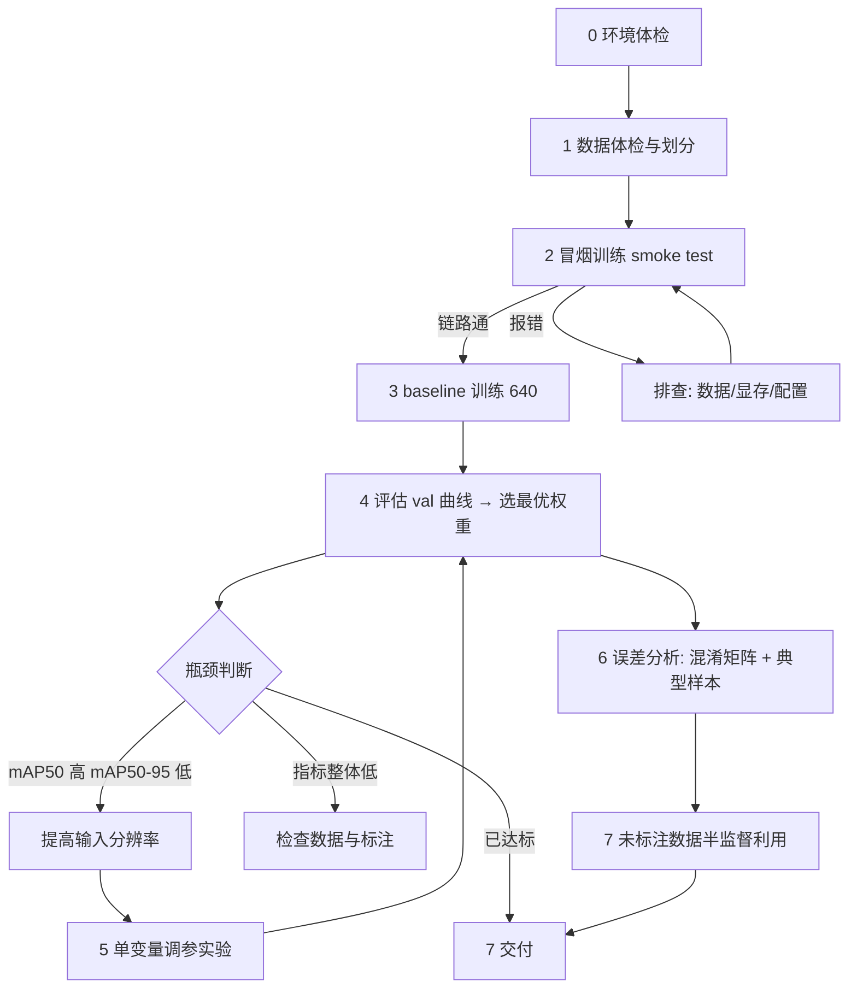

# 训练全流程（从零到交付）

这份文档记录本次作业的完整周期，每一步都写清 **目标 / 命令 / 产物 / 判断标准**，便于以后复用。全部命令都在仓库的 `code/` 下，路径以作业根目录为基准。

## 阶段总览



---

## 阶段 0　环境体检（10 分钟）

**目标**：确认显卡、CUDA、框架版本三者匹配，避免训到一半才发现环境问题。

```bash
nvidia-smi                                       # 显卡型号、显存、驱动、CUDA 版本
conda activate ai-env
python -c "import torch; print(torch.__version__, torch.cuda.is_available(), torch.cuda.get_device_name(0))"
cd codebase/ultralytics-YOLO26 && python -c "import ultralytics; print(ultralytics.__version__, ultralytics.__file__)"
```

**判断标准**

- `torch.cuda.is_available()` 为 `True`，且显卡型号与 `nvidia-smi` 一致
- `ultralytics.__file__` 指向**作业提供的本地源码**（而非 site-packages），否则 YOLO26 的结构定义可能对不上
- 显存决定后面的 batch 上限：8G 卡在 `imgsz=640` 可用 `batch=8`，`imgsz=960` 建议 `batch=4`

**本次记录**：RTX 5060 Laptop / 8151 MiB / 驱动 595.91.07 / CUDA 13.2 / torch 2.7.1+cu128 / Python 3.11.16

---

## 阶段 1　数据体检与划分（30 分钟）

**目标**：把"能用"的数据变成"可信"的训练集，并留下可复现的划分。

```bash
python code/prepare_data.py --dry-run    # 只看统计，不写文件
python code/prepare_data.py              # 真正划分，生成 datasets/rm/ 与 data.yaml
python -c "from ultralytics.data.utils import check_det_dataset; check_det_dataset('datasets/rm/data.yaml')"
```

**体检要看的四件事**

1. 图片与标签是否成对（多一张图少一个 txt 就会在训练中途报错）
2. 标签格式：YOLO 的 `class cx cy w h`，坐标归一化在 0~1 内
3. 类别数：本次标签首列全为 `0`，即单类别，`data.yaml` 里 `nc: 1`
4. 目标密度分布：本次平均 4.54 框/图，最多 16 框——**这个数字后面用来判断模型的输出是否合理**

**划分策略：按框数分层抽样**

数据集里混了两类画面：比赛 HUD 俯视截图（目标小、数量多，常 8~16 个）和现场实拍（目标大、1~3 个）。纯随机划分会让某一集合扎堆某类场景，验证指标随划分抖动，调参就失去意义。

本次做法：按每图框数分桶（1-2 / 3-6 / 7-10 / 11+），桶内按 70/15/15 抽样，固定 `seed=42`。

| 集合  | 图片数 | 平均框数 |
| ----- | ------ | -------- |
| train | 1057   | 4.52     |
| val   | 227    | 4.59     |
| test  | 227    | 4.56     |

**判断标准**：三个集合的平均框数接近（差异 <5%），说明分层有效。

**纪律**：`test` 集从划分完成到交付**只评估一次**。一旦用它反复试参数，它就退化成 val，最终成绩不可信。

---

## 阶段 2　冒烟测试（15 分钟，最容易被跳过但最不该跳过）

**目标**：用极小代价跑通整条链路，提前暴露标签越界、显存不足、路径错误、类别数不匹配等问题。

```bash
python code/train.py --name smoke --epochs 1 --fraction 0.02 --imgsz 320 --batch 4 --workers 2 --device 0
```

**为什么值得做**：本作业第一次正式训练就把整机拖死（见 `03-常见问题`），如果直接挂 2 小时的大训练，损失的是整晚。

**判断标准**：`runs/smoke/` 下出现 `results.csv` 与 `weights/best.pt`，且过程无报错。此时的 mAP 没有参考价值，不要据此判断模型好坏。

---

## 阶段 3　baseline 训练

**目标**：得到第一个有参考价值的模型，作为后续所有对比的基准。

```bash
python code/train.py --name baseline_n_640 --epochs 200 --imgsz 640 --batch 8 --workers 2 --device 0
```

**baseline 的定义就是不调参**：imgsz 640（YOLO 系列的预训练原生尺寸）、batch 8、其余全默认。这样后面任何改动都能归因。

**本次结果**：第 146 轮达到最优（val mAP50 0.9366 / mAP50-95 0.6360），第 196 轮触发早停（patience=50），总耗时 36 分钟、平均 11 秒/轮。

**判断标准**

- 前 10 轮 mAP50 应快速上升到 0.8 以上（迁移学习的正常表现）；如果一直贴地，先查数据而不是查模型
- 训练 loss 持续下降，验证 loss 在某轮后开始回升 = 过拟合，此时 `best.pt` 已经锁定在最优轮次

---

## 阶段 4　评估

**目标**：用 val 集选权重，用 test 集给出唯一一份可对外报告的成绩。

```bash
# 训练过程中 ultralytics 每轮会自动在 val 上评估，曲线见 results.csv
python code/eval.py --weights runs/exp_imgsz960_v2/weights/best.pt --split test --imgsz 960 --batch 4
```

**三个指标怎么看**

| 指标     | 含义               | 用途                             |
| -------- | ------------------ | -------------------------------- |
| mAP50    | IoU>0.5 即算命中   | 反映"能不能找到目标"             |
| mAP75    | IoU>0.75           | 反映"框得准不准"，对定位精度敏感 |
| mAP50-95 | 10 个 IoU 阈值平均 | 综合指标                         |

**本次关键发现**：baseline 的 mAP50 已 0.94，但 mAP50-95 只有 0.63。两个指标的巨大落差直接说明瓶颈是定位精度，而不是检测能力。**这个判断决定了后面所有的调参方向。**

**纪律**：推理尺寸必须与训练尺寸一致。用 640 评估 960 训练的模型，mAP50-95 会白掉约 0.02。

---

## 阶段 5　单变量调参

**目标**：每一组实验只改一个变量，保证收益可归因。

**优先级由指标结构决定**，而不是凭感觉试：

| 症状                         | 优先尝试           | 理由                             |
| ---------------------------- | ------------------ | -------------------------------- |
| mAP50 高、mAP50-95 低        | 提高 `imgsz`       | 定位精度不足，小目标需要更多像素 |
| mAP50 与 mAP50-95 都低       | 查标注质量、加数据 | 可能连目标都没找到               |
| 训练 loss 正常、验证指标不涨 | 检查划分与增强强度 | 可能是过拟合或验证集难易不一致   |

**本次执行**：640 → 960（只改 `imgsz`，batch 因显存从 8 降到 4）。结果 mAP50 +2.1%、mAP75 +6.3%、mAP50-95 +5.4%——收益随 IoU 阈值升高而放大，验证了"瓶颈在定位"的判断。

**时间预算规则**：先用小规模测出单轮耗时，再决定 epoch 数，避免排不下时间。

| 单轮耗时  | epoch 建议         |
| --------- | ------------------ |
| ≤30 秒    | 120~200            |
| 30~60 秒  | 80                 |
| 60~120 秒 | 50                 |
| >120 秒   | 40，并考虑降 imgsz |

---

## 阶段 6　误差分析（决定"下一步改什么"）

**目标**：把总指标拆成可行动的结论。

```bash
python code/analyze_errors.py --weights runs/exp_imgsz960_v2/weights/best.pt --split test --imgsz 960
```

**分析顺序**

1. 看混淆矩阵：把误差拆成漏检（FN）和误检（FP）。本次 test 集 1036 个目标中漏检 73 个（7.0%）、误检 76 个，误差分散，没有出现某一类场景系统性失效
2. 看典型失败样本：本次抽查发现主要失效模式是"预测框把相邻背景（背包、器材）一起框进来"，与标注框 IoU 只有 0.529——在 mAP50 上算命中，在高 IoU 阈值上丢分
3. 从失效模式反推改进方向：补充遮挡/杂物密集场景的标注数据，统一"目标与相邻物体粘连时的边界界定"

---

## 阶段 7　未标注数据的半监督利用

**目标**：把 302 张未标注图变成可用的训练数据，且不污染评估。

**两条不能碰的红线**

1. 不能直接给它们配空标签当负样本——图上大多有目标，等于教模型"这里不要框"
2. 不能把它们放进 val/test——没有标签就算不出可信指标

**正确流程**（工具链已实现）

```bash
python code/autolabel.py --conf 0.25            # 1. 用当前最优模型生成预标注 + 可疑样本检查图
# 2. 人工核对：修错的框、删掉不该有的小地图框、确认零检出图是否真无目标
python code/merge_addon.py --dry-run --min-conf 0.5 --drop-minimap   # 3. 过滤策略先预演
python code/merge_addon.py --min-conf 0.5 --drop-minimap             # 4. 构建独立数据集 datasets/rm_plus
python code/train.py --name exp_960_addon --data datasets/rm_plus/data.yaml --epochs 150 --imgsz 960 --batch 4
python code/eval.py --weights runs/exp_960_addon/weights/best.pt --split test --imgsz 960 --batch 4
```

**本次进度**：完成第 1 步与统计评估（300 张 / 1349 框 / 平均 4.50 框每图，与人工标注 4.54 基本一致；最高置信度中位 0.92），并据此判定方案可用；人工核对与并入训练列为后续工作。

**判定规则（先定死，避免事后找理由）**：新模型在 test 上的 mAP75 高于 0.8202 就采纳，否则保留原模型并把负结果也记录下来。

---

## 阶段 8　交付

```bash
cp runs/exp_imgsz960_v2/weights/best.pt model.pt
zip -r "RM第四次培训-自动化2605-刘**.zip" "RM第四次培训-自动化2605-刘**.pdf" "model.pt"
```

**交付三件套**：文档 PDF、模型权重、训练表格（本仓库的 `results/summary.csv`）。

**必须在文档里写明推理配置**：本次模型在 imgsz=960 下训练，若举办方用 640 推理会白掉约 0.02 mAP50-95。

---

## 决策规则速查

| 情况                       | 动作                                                       |
| -------------------------- | ---------------------------------------------------------- |
| 冒烟测试报错               | 先修链路，不要开始正式训练                                 |
| 前 10 轮 mAP50 < 0.5       | 查数据与标签，不要调参                                     |
| 训练 loss 降、验证 loss 升 | 过拟合，靠 `best.pt` + 早停兜底                            |
| mAP50 饱和但 mAP50-95 低   | 提高分辨率或补难样本                                       |
| 单轮耗时突然变化           | 先怀疑配置被改（例如续训覆盖参数）                         |
| 时间不够                   | 优先保证「能推理 → 有指标 → 有文档」，放弃收益不确定的调参 |
